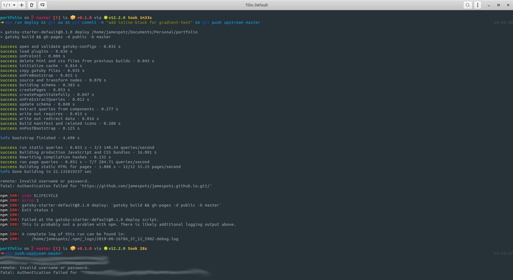
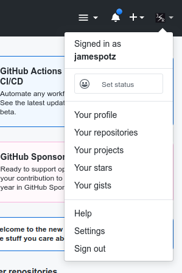
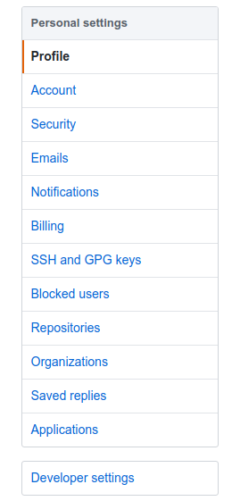

Today I faced an issue when pushing my recent changes to my Github repo. It was causing access authentication faillure even if I've given my credentials correctly. I found that it was caused by enabling two factor authentication that I enabled yesterday.

In a nutshell two factor authentication is an added layer of security. Without it your Github account can be easilly accessed by someone with your correct password. The only way that someone could hack into your account is if they know your password and have access to your phone.

To be able to push, pull, and clone your repo you need to setup a token that you will then used as a password. Firstly, make sure you are signed in in your Github account, navigate to the right where you're avatar is located, and hover over it and look for settings.

Secondly, on your settings page look for 'Developer Settings' and on the next page you need to click on 'Personal access tokens', and then you will
see a 'Generate new token' button.

Finally, give the access token a name and select scopes of your personal token. Once done you can now use your access token as your password and save it on a keyring.

**Note**: Store your access token in keyring or on a password manager.
